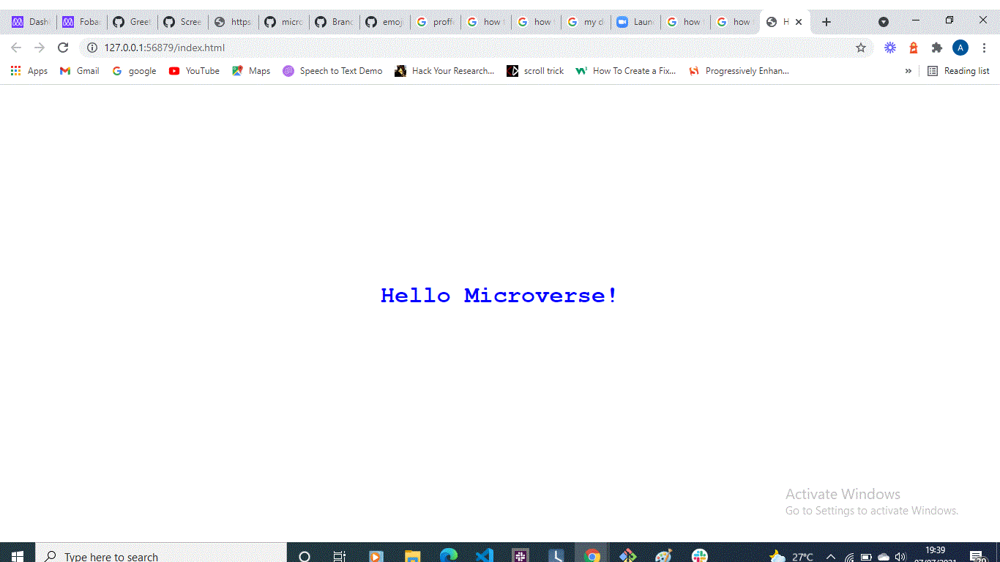

## Hello-microverse

A site displaying "Hello Microverse"

It displays a blue hello world text, centred vertically and horizontally using margin and text-align properties in CSS

## Built With

● HTML

● CSS

## Technologies used

● Linters

● Git and Github

## Getting Started

To get a local copy up and running follow these simple example steps.

:white_large_square: clone the app by running this command `git clone https://github.com/fobadara/hello-microverse.git`

:white_large_square: Move into the directory with this command `cd hello-microverse`

:white_large_square: Open in browser

## Prerequisites

You will be needing:

-A web browser to view output

-A text editor

## Run tests

-You can run tests by reloading on the pull request I have created or simple create a pull request of your own

## Authors

👤 Abdulfatai Badara

GitHub: github.com/fobadara

Twitter: fob90s@twitter.com

🤝 Contributing

Contributions, issues, and feature requests are welcome!

Feel free to check the issues page.

## Show your support

Give a ⭐️ if you like this project!

## Acknowledgments

Hat tip to anyone whose code was used
